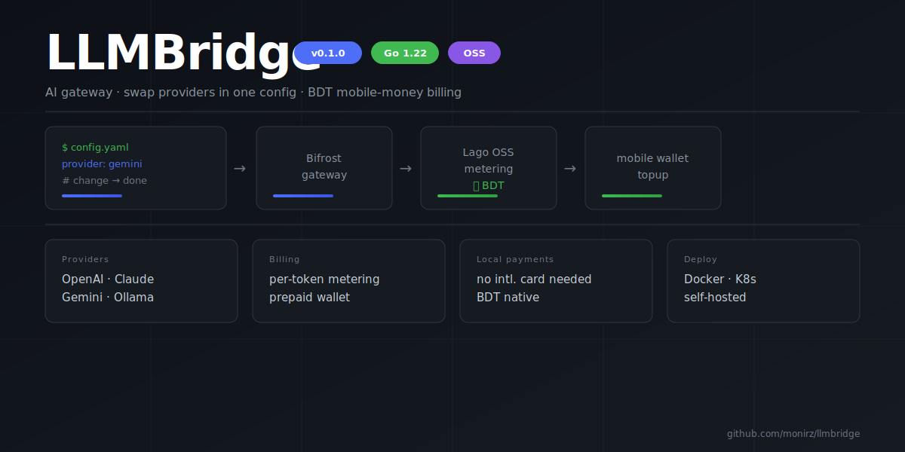

# LLMBridge

LLMBridge is a concept of a single platform where users can access and switch between any AI provider — cloud or self-hosted — without changing their application code. Just update the config and run one command.

It is built on top of [Bifrost](https://github.com/maximhq/bifrost), an open-source high-performance AI gateway that handles provider routing, failover, and load balancing out of the box. Bifrost turns what would normally require separate integrations for each provider into a single, ready-made solution.

The meter billing infrastructure using [Lago](https://github.com/getlago/lago) is in the [`lago` branch](https://github.com/monirz/llmbridge/tree/lago) — tracking token usage per user and enabling payment through local payment methods, removing the dependency on international cards.

---


## Run

Clone the repo and cd into it:

```bash
git clone https://github.com/monirz/llmbridge.git
cd llmbridge
```

Then start all services:

```bash
docker compose up --build
```

Once everything is up:

- **http://localhost:9000** — LLMBridge chat UI
- **http://localhost:8080** — Bifrost gateway dashboard

By default it runs with the self-hosted `qwen2.5:3b` model via Ollama — no API key needed. Bifrost, Ollama, and LLMBridge are all managed under the same `docker compose`.

---

## Switch providers

Create a `.env` file in the project root. See `.env.example` for all available variables.

**Ollama — local, no API key (default):**

```env
MODEL=ollama/qwen2.5:3b
```

**Gemini:**

```env
GEMINI_API_KEY=your_key_here
MODEL=gemini/gemini-2.5-flash
```

**Claude:**

```env
ANTHROPIC_API_KEY=your_key_here
MODEL=anthropic/claude-haiku-3-5
```

**OpenAI:**

```env
OPENAI_API_KEY=your_key_here
MODEL=openai/gpt-4o-mini
```

Ollama starts automatically when `MODEL` is set to `ollama/*` or not set at all. Any other model skips Ollama and the download entirely.

---